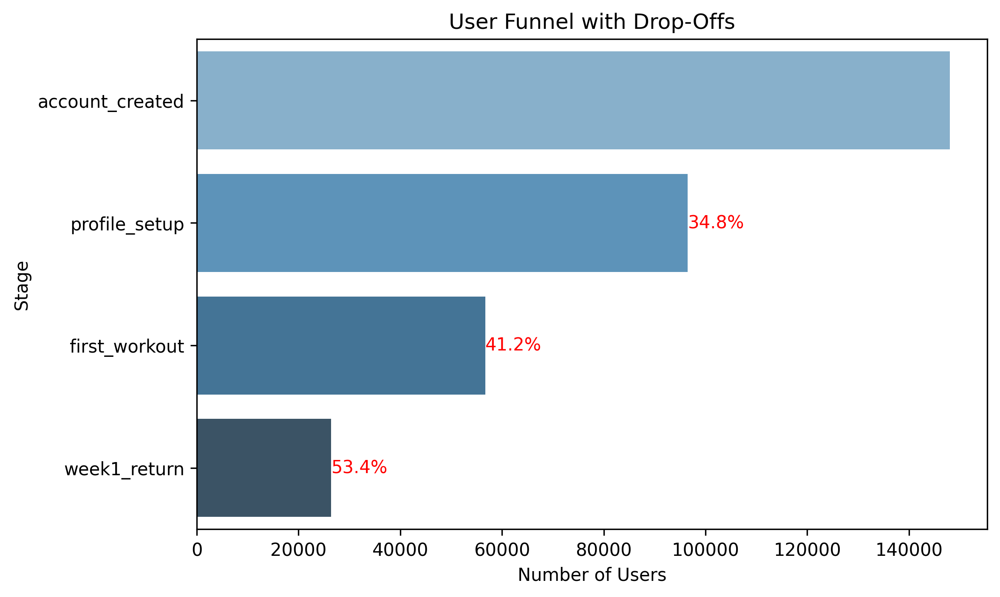
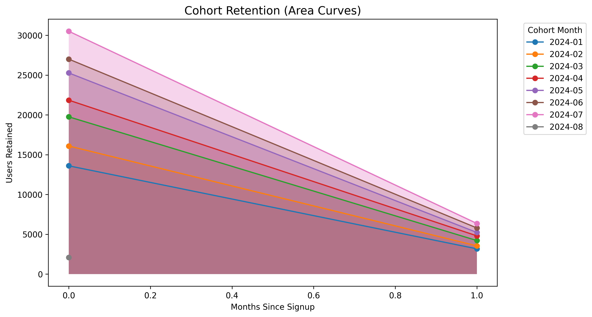

# 📊 User Funnel Analysis & Optimization (Python + SQL)

## 🚀 Project Summary  
End-to-end **funnel analysis project** for a simulated **fitness tracking app**, combining **SQL + Python** to uncover where users drop off and how retention changes over time.  

---

## 🔧 Tools & Skills  
- **SQL (SQLite)** → funnel queries, cohort analysis  
- **Python (Pandas, Seaborn, Matplotlib, SciPy)** → visualization & statistics  
- **Jupyter Notebook** → analysis workflow + storytelling  
- **GitHub** → version control & presentation  

---

## 📈 Key Results  
- **Conversion Funnel** → Identified **~65% profile setup rate** and **~40% week-one retention**  
- **Drop-Off Analysis** → Biggest drop occurs between account creation and first workout  
- **Cohort Retention** → Consistent 20–23% retention after 1 month across cohorts  
- **Statistical Testing** → Chi-square confirmed significant stage-wise differences  

---

## 📊 Example Visuals  

**Funnel Chart**  
  

**Cohort Retention Curve**  
  

---

## 🎯 Why This Project Matters  
This project shows my ability to:  
- Design a **synthetic dataset** with business logic  
- Use **SQL for funnel/retention analysis**  
- Apply **Python for visualization & insights**  
- Communicate findings clearly in a polished report  
